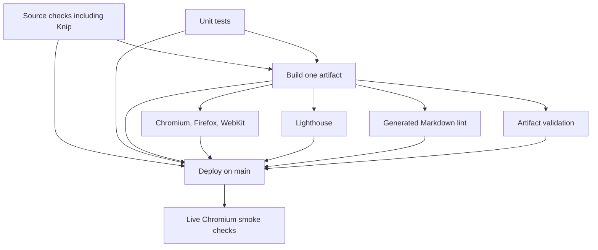

# CI for this deployed website

The pipeline checks source first, builds once, tests that output, and deploys the same files. It is designed
for a
single Astro site with articles, CMS, resume exports, analytics, and a custom domain. Forge is comparison
material;
its package, generator, and template compatibility jobs are not requirements for this site.

## Execution order

| Job                       | Work it owns                                                       | Input and dependencies                                           |
| ------------------------- | ------------------------------------------------------------------ | ---------------------------------------------------------------- |
| `format`                  | Check formatting                                                   | Source checkout; independent job                                 |
| `lint-code`               | Lint code                                                          | Source checkout; independent job                                 |
| `lint-styles`             | Lint styles                                                        | Source checkout; independent job                                 |
| `lint-markdown`           | Lint source Markdown                                               | Source checkout; independent job                                 |
| `spellcheck`              | Spellcheck source                                                  | Source checkout; independent job                                 |
| `audit-unused`            | Audit unused code and dependencies                                 | Source checkout; independent job                                 |
| `typecheck`               | Check TypeScript and Astro diagnostics                             | Source checkout; independent job                                 |
| `test-unit`               | Unit tests, including CI dependency and failure-policy tests       | Source checkout; parallel with static checks                     |
| `build`                   | One Astro build and artifact upload                                | Requires all source checks and unit tests                        |
| `validate-build`          | Validate required production artifacts                             | Downloads `site-build`; parallel with other artifact checks      |
| `test-browser`            | Full behavior, accessibility, and mobile coverage in three engines | Downloads `site-build`; never builds                             |
| `lint-generated-markdown` | Lint generated resume Markdown                                     | Downloads `site-build`; parallel with browsers and Lighthouse    |
| `lighthouse`              | Performance, accessibility, best-practice, and SEO budgets         | Downloads `site-build`; never builds                             |
| `deploy`                  | Publish the packaged output                                        | Requires every pre-deployment job; only runs on pushes to `main` |
| `smoke-deployed`          | Live route/content/asset/mobile checks                             | Uses the URL returned by successful deployment                   |

Source checks and unit tests run in independent jobs so they execute concurrently and report all failures.
Each job owns one check and installs its dependencies separately. Any failed check prevents the build. Browser
tests
and Lighthouse run in separate jobs after the build; their independence avoids browser resource contention
affecting
Lighthouse measurements.

The build job uploads `site-build`. Artifact validation, generated Markdown lint, browser tests, and
Lighthouse each download that output and run independently in parallel. On `main`, it
also packages
those same files for GitHub Pages. Packaging does not publish them. The test jobs download `site-build` from
this run,
and only successful prerequisites allow deployment. There are no downstream rebuilds or artifact mutations.
This matters because financial-scope values can refresh during a build: separately rebuilding for tests and
deployment
could validate different content even at the same source revision.

Deployment directly depends on every source check, unit tests, artifact validation, browser tests, and
Lighthouse. GitHub's default success condition prevents deployment if any prerequisite fails or is skipped;
there is no aggregate job. Deployment and live smoke checks are intentionally skipped on PRs.

When adopting this workflow, retain the repository ruleset's required `build` context and require all thirteen
pre-deployment checks: `format`, `lint-code`, `lint-styles`, `lint-markdown`, `spellcheck`, `audit-unused`,
`typecheck`, `test-unit`, `build`, `test-browser`, `lighthouse`, `lint-generated-markdown`, and `validate-build`.
Requiring every check prevents
a skipped downstream job from hiding a source failure. Browser checks alone do not cover Lighthouse failures.
New PR commits cancel obsolete PR runs. Runs on `main` are serialized instead of cancelling a deployment or its
verification when another commit arrives.

## Each check has one owner

- Formatting and spelling run once over source. CSS/code/Markdown linters check distinct syntax and style
  rules.
- `npm run typecheck` runs `astro check`, which checks TypeScript and Astro files through the project
  configuration.
  `astro:check` is retained as a manual alias, but CI and `quality` do not invoke both. A temporary
  TypeScript error in a
  standalone script was confirmed to fail Astro checking before removing the redundant `tsc` invocation.
- Source Markdown lint excludes `dist/`; generated resume Markdown is checked once after generation.
- Unit tests run once. Workflow contract tests verify independent checks and deployment dependencies. Coverage
  reports and runtime compatibility matrices are separate policy work, not duplicate
  unit-test runs added here.
- Browser accessibility tests inspect behavior and WCAG rules. Lighthouse measures performance and
  page-level budgets.
  Those checks have different purposes even where both report accessibility; neither rebuilds the site.
- The small live smoke suite is separate from the full browser suite. It checks the hosting result after
  publishing,
  including HTTP responses and missing assets that a local preview cannot prove. It retries twice for
  transient
  availability and retains failure evidence. It does not roll back a deployment automatically or prove that
  a CDN
  has refreshed every file to the latest revision.

`npm run quality` follows the same sequence locally, with browser tests and Lighthouse using one build.
`npm run lighthouse:ci` requires an existing `dist/`; it does not build. `npm run test:smoke` uses the local
preview unless
`DEPLOYMENT_URL` supplies the HTTPS live URL. CI uses the deployment action's URL rather than a separately
maintained
host constant.

## Required unused-code policy (issue #12)

Knip runs in the required `audit-unused` job and in the local `quality` command. Findings block compilation
and deployment.
The current entry points are recognized without a broad ignore list:

- Knip's Astro integration discovers Astro routes, layouts, components, and imported CMS initialization code.
- npm scripts expose the build validator and preview helper as explicit executable entry points.
- Vitest and Playwright configurations identify tests, support code, and both browser configurations.
- Sveltia configuration and preview registration are imported from the admin route; they remain reachable
  through that
  integration boundary rather than being marked as universally used exports.

If a new dynamic integration produces a false positive, first make its real entry point discoverable through
the
appropriate configuration or an explicit npm script. Add a narrowly scoped Knip entry only when that cannot
express
the boundary, and document why. Do not disable the job or ignore whole directories to make a release pass.
Review this
policy when Astro, Sveltia, or Knip changes discovery behavior.

This is an unused-code/dependency check, not a security audit. Existing dependency-advisory policy remains
tracked in
issues #11 and #70. CodeQL, dependency review, and automation syntax/security scans retain their existing
separate
triggers and policies; they are not reruns of the source spelling, formatting, or type checks. Their
advisory versus
required status is not changed by this pipeline refactor.

## Evidence and limits

Validated builds and Lighthouse reports are retained for 14 days. Browser and live smoke failures retain
screenshots,
traces, and HTML reports for 14 days. Uploaded artifacts use the existing pinned GitHub actions and
least-privilege
job permissions. Only the deployment job has Pages write permission.

CI still uses the repository's existing `lts/*` runtime policy; changing the supported Node/npm matrix
belongs to #72.
No new dependency, coverage target, Lighthouse threshold, or security exception is introduced here.
Repeating tests on
a PR and the resulting `main` commit is intentional: the latter is the actual deployment revision.

## Lessons to compare with Forge

Forge's website workflow currently has source quality, compatibility, validation/build, browser, and
Lighthouse jobs
all depending directly on change classification. Its website compatibility and validation jobs both build on
Node 26,
and `website:lighthouse` calls a script that builds again. Its website source-quality and compatibility
paths also
both invoke type checking. Those are candidates for consolidation for the website, while
package/generator/template
compatibility checks can have distinct reasons to repeat work across supported environments.

A useful upstream proposal is to give the website independent source checks and one validated artifact, make browser and
Lighthouse consumers depend on it, require each check for merging and deployment, and retain a small post-deployment
check.
Apply this selectively rather than copying this site's route list, resume policy, or performance thresholds.
